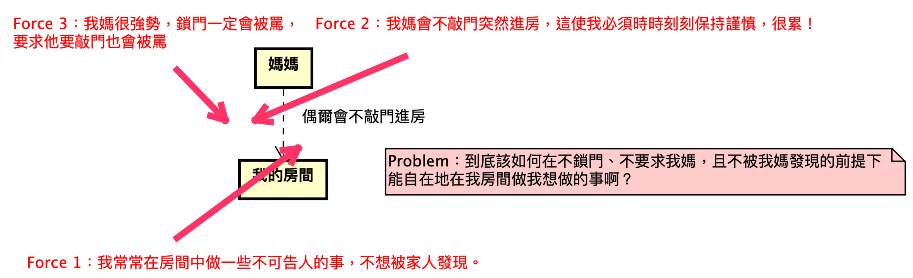

# OOADP_GYM_2
軟體設計模式精通之旅 - 道館二 - 實作交友配對系統

## **實作交友配對系統 ★**

### **策略模式——你的配對策略是什麼呢？**

*難度：★☆☆☆☆*

你正在開發一個交友配對系統 (Matchmaking System)。

1. 你手邊有一大群對象 (Individual) 資料，每一筆資料皆記載著以下欄位：
    1. 編號 (ID)：正整數 (>0)，每位對象的編號都不同。
    2. 性別 (Gender)：`MALE` 表示男生、`FEMALE` 表示女生
    3. 年紀 (Age)：正整數；至少 18 歲。
    4. 自我介紹 (Intro)：長度約 0~200 的文字。
    5. 興趣 (Habits)：可以為多個興趣，每個興趣以 1~10 長度的文字表示，每個興趣之間以一個逗號隔開。例如：`打籃球, 煮菜, 玩遊戲`
    6. 座標 (Coord)：以 $(x, y)$ 表示該用戶所在的 x 軸和 y 軸的位置。
2. 你要撰寫一個配對系統 (Matchmaking System)，**系統會幫每位用戶配對最適合他的用戶，** 而你的系統主要提供了兩種配對策略，並且未來會持續新增新的策略：
    1. **距離先決 (Distance-Based)：** 配對與自己距離最近的對象（距離相同則選擇編號較小的那位）。
        1. 假設自己的座標為 $(x,y)$ 而對象的座標為 $(x',y')$，則距離公式為：$\sqrt{(y-y')^2+(x-x')^2}$

    2. 興趣**先決 (Habit-Based)：** 配對與自己興趣擁有最大交集量的對象（興趣交集量相同則選擇編號較小的那位）。
3. 不過，也有用戶喜歡認識更多元的人，因此你的系統還要為你每個策略提供「**反向 (reverse)**」的實作版本，像是把距離先決的策略改成是配對與自己距離最遠的對象，而把興趣先決改成是配對與自己興趣擁有**最小交集量**的對象。

### **設計需求（非功能性需求）**

由於客戶會不斷研發新的配對策略，我們希望系統能夠允許 Client (程式中系統的使用方，通常會是你的 **Main method**）能在外部抽換系統的配對策略。

### **進階挑戰題**

你想得到如何遵守以下條件來來實踐需求 (3) —— 反向策略嗎？

1. 「配對系統類別/距離先決策略/興趣先決」類別不能直接耦合「反向 (Reverse)」的概念，也不能使用 boolean 欄位 (e.g., `reverse: boolean`) 或是參數 (e.g., `match(…, …, reverse: boolean)`) 來區分正反向。
    1. 以下這些都是被禁止的錯誤示範：
        1. `new MatchmakingSystem(new DistanceBasedMatchmakingStrategy(), Reverse=True)` (X)
        2. `matchMakingSystem.match(individual, Reverse=True)` (X)
        3. `distanceBasedStrategy.reverse()` (X)
        4. `new DistanceBasedStrategy(Reverse=True)` (X)
        5. `matchMakingSystem.reverse()` (X)
2. 不組合爆炸：意即你不能讓程式中出現攸關於「正向距離先決、反向距離先決、正向興趣先決、反向興趣先決」概念的四個類別，只要你有四個配對策略的類別，就是組合爆炸了，是不被允許的。

**試試看吧！**

### **作答要求**

在你實際作答之前，我想要對你做一些要求，來幫助你儘早了解這門課的精華。

由於這一題是「策略模式」的題目，所以你肯定知道這一題就是要套「策略模式」。不過，在這門旅程中要學的是「精準設計」，所以你要趁在這一題比較簡單的題目中，就趕緊試試看「精準設計」的思路。

也就是說，你不能只是套用策略模式，你必須先「察覺 Forces（拘束）」，從需求和非功能性需求中，你辨識出了哪些已在策略模式的案例影片中學過的 Forces 呢？

請在 UML 上使用「紅色的箭頭」來繪製 Forces，把 Forces 放在相關的行為/結構附近，並將衝突的 Forces 定義成一道 Problem，用便條紙來表達 Problem，看起來就像這個樣子：

如果你真的佐證了策略模式的必要之處，那你一定至少會在某些類別附近，察覺了至少兩道 Conflicting Forces，並基於這兩道 Forces 來定義 Problem。而這兩道 Forces 符合策略模式所解決的 Conflicting Forces，所以才證明了你能夠套用策略模式。

試試看吧！